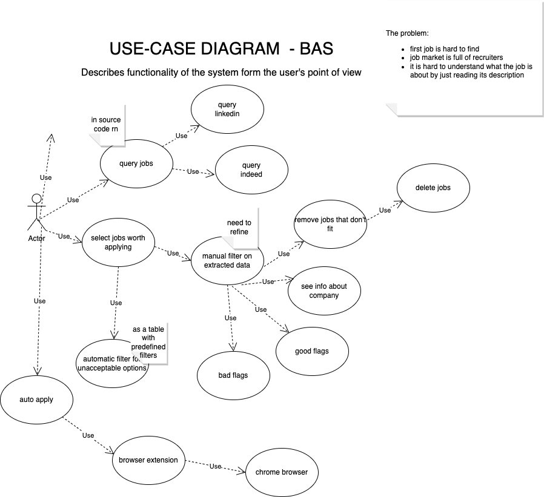

# Blanket application strategy

## Overview

This app automates headless browser to search for jobs on Indeed/Linkedin job-boards and presents results in a tabular form such that you can see all info about companies and openings at a glance.  
It runs **in Docker locally** onl and all data are saved to a database locally.   
You can 
 - filter by postings to your liking  
 - mark as deleted postings that are of no interest to you  
 - save notes about postings and companies  
 - automatically ignore certain companies [coming soon]
 

Further you can utilize the following auto-apply browser extensions:
[joinrhubarb](www.joinrhubarb.com),
[easyjobs](www.easyjobs.so),
[simplify](www.simplify.jobs)
to save even more time on your applications


## Demo


## Stack

- React
- Tabulator
- Python
- Asyncio
- BeautifulSoup
- Playwright
- Flask
- SQLAlchemy
- Sqlite
- Celery
- Redis

## Usage

See [Docker Hub](https://hub.docker.com/r/vadzimk/bas) for usage


## Limitations of the current version
- Generally Linkedin blocks you if you browse too much. There is a delay on crawling, but it does not guarantee no-blocking. There is a button [UPDATE USER] to update Linkedin credentials once the previous account gets blocked. 
- Playwright by Microsoft has a bug that leaks memory. I did not know that before selecting an automation framework, so the headless browser may crash with error [Navigation failed because page crashed!](https://github.com/microsoft/playwright/issues/6319)
- Before filling out search form determine the "Where" location that is auto suggested on a particular job-board, for example should be "Los Angeles, California" for Linkedin and "Los Angeles, CA" for Indeed.  

## Development
```bash
docker-compose -f docker-compose.dev.yml up -d
cd src  
flask db init  # adds support to db migrations  
flask db migrate # creates migration script  
flask db upgrade # applies changes to db  
celery -A app.celery worker --loglevel=info  --concurrency=1  # process 1 concurrent task in a queue
export FLASK_DEBUG=1
flask run -p 5000
python -m bas_app.scraper.man # for manual testing of selectors  
``` 


## Diagrams
### Use-case

### Entity-relationship


