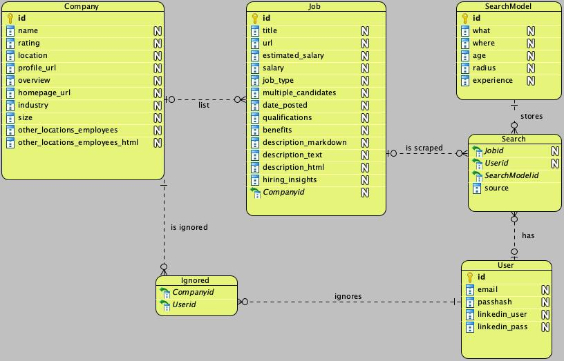

# Blanket application strategy

(Job board scrapper)

## Overview

This is an Indeed/Linkedin job board scrapper that actually works.

## The problem

Job boards cater to employers but not job seekers  
Job boards make it longer to find the necessary information about the employer.  
Job boards do not provide necessary tools to filter postings  
Job postings are full of hr jargon that is unnecessary

## Solutions

Flip job board pages until you get tired   
Use the BAS app that will scape job boards for you and let you select eligible companies and listings  
And use auto-apply browser extensions:
[joinrhubarb](www.joinrhubarb.com),
[easyjobs](www.easyjobs.so),
[simplify](www.simplify.jobs)
to save even more time on your applications

## Demo

## Stack

- Vanilla JS ~> React
- Tabulator
- Python
- Asyncio
- BeautifulSoup
- Playwright
- Flask
- SQLAlchemy
- Sqlite
- Celery
- Redis

## Usage

poetry shell  
poetry install   
poetry run python3 scraper/main.py  
poetry run flask run

## Development

cd src  
flask db init  _# adds support to db migrations_  
flask db migrate _# creates migration script_  
flask db upgrade _# applies changes to db_  
celery -A app.celery worker --loglevel=info  
flask run -p 5000  

## Diagrams
### Use-case

### Entity-relationship

