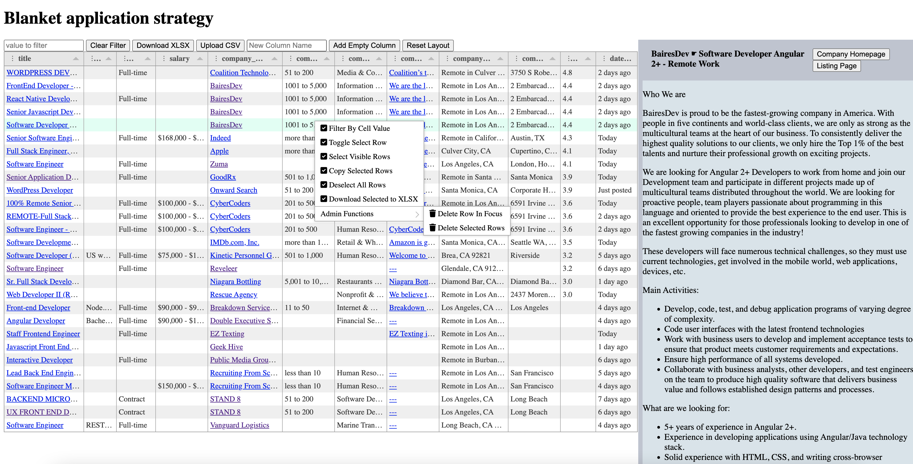

# Blanket application strategy 
(Job board scrapper)

## Overview

This is an Indeed/Linkedin job board scrapper that actually works.

## The problem

Job boards cater for employers but not job seekers  
Job boards make it longer for you to find the necessary information about the employer.  
Job boards do not provide necessary tools to filter postings

## Solutions

Flip job board pages until you are tired  
Scrape data and read in excel, but you cannot expand job descriptions comfortably  
Use the BAS app that will scape job boards for you and let you filter and sort companies and listings  
And use autoplay browser extensions to save even more time on applications:
[joinrhubarb](www.joinrhubarb.com),
[easyjobs](www.easyjobs.so),
[simplify](www.simplify.jobs),

## Demo

## Stack

- Vanilla JS (maybe framework later)
- Tabulator
- Python
- Asyncio
- BeautifulSoup
- Playwright
- Flask
- Sqlite

## Usage

poetry shell  
poetry install   
poetry run python3 scraper/main.py  
poetry run flask run

## Development

poetry run flask db init  _# adds support to db migrations_  
poetry run flask db migrate _# creates migration script_  
poetry run flask db upgrade _# applies changes to db_

